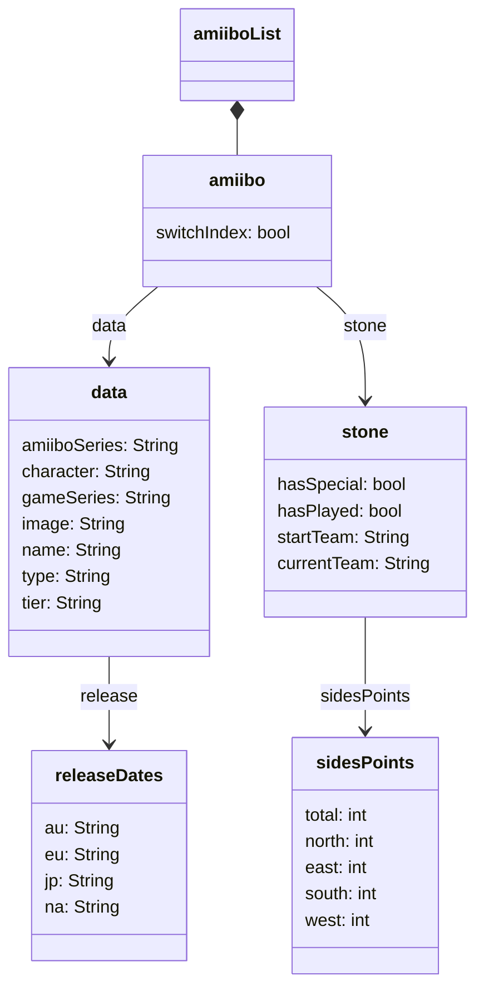

<div align="center">

# :flower_playing_cards: Amiistones :flower_playing_cards:
Powered by <a href="https://amiiboapi.com" target="_blank">AmiiboAPI</a> - 
Meet the <a href="https://github.com/orgs/amiistones/people">team</a>!

</div>
<br/>

Put any description here

## Objects structures

<details>
	<summary>stage (game's board)</summary>

### `stage`

`stage` is an object that represents the *amiistones* game's board.

***Awaiting for description***

</details>

<details>
	<summary>amiibo and amiiboList (data)</summary>

### `amiibo` and `amiiboList`

`amiibo` is an element of `amiiboList`. These two objects defines all the data fetched from the api and then display on the *amiistones* game's board.

#### `amiibo`

All classes in the following diagram are actually JavaScript objects (this is just to have a more visual render).



All the fields in the `data` sub-object is from the api (except the `tier` attribute).

<details>
	<summary>Template</summary>

```jsx
data: {
	amiiboSeries: null,
	character: null,
	gameSeries: null,
	image: null,
	name: null,
	release: {
		au: null,
		eu: null,
		jp: null,
		na: null
		},
	type: null,
	tier: "F"
},
stone: {
	hasSpecial: false,
	hasPlayed: false,
	startTeam: null,
	currentTeam: null,
	sidesPoints: {
		total: null,
		North: 0,
		East: 0,
		South: 0,
		West: 0
	},
},
switchIndex: null
```
</details>

<details>
	<summary>Examples</summary>

```jsx
data: {
	amiiboSeries: "Super Smash Bros.",
	character: "Mythra",
	gameSeries: "Xenoblade Chronicles",
	image: "https://raw.githubusercontent.com/N3evin/AmiiboAPI/master/images/icon_22420000-041f0002.png",
	name: "Mythra",
	release: {
		au: "2023-07-21",
		eu: "2023-07-21",
		jp: "2023-07-21",
		na: "2023-07-21"
		},
	type: "Figure",
	tier: "S"
},
stone: {
	hasSpecial: true,
	hasPlayed: true,
	startTeam: "red",
	currentTeam: "blue",
	sidesPoints: {
		total: 12,
		North: 3,
		East: 3,
		South: 2,
		West: 4
	},
},
switchIndex: 79
```

```jsx
data: {
	amiiboSeries: "Super Smash Bros.",
	character: "Cloud Strife",
	gameSeries: "Final Fantasy",
	image: "https://raw.githubusercontent.com/N3evin/AmiiboAPI/master/images/icon_36000000-02590002.png",
	name: "Cloud",
	release: {
		au: "2017-07-22",
		eu: "2017-07-21",
		jp: "2017-07-21",
		na: "2017-07-21"
		},
	type: "Figure",
	tier: "A+"
},
stone: {
	hasSpecial: false,
	hasPlayed: false,
	startTeam: "blue",
	currentTeam: null,
	sidesPoints: {
		total: 10,
		North: 2,
		East: 3,
		South: 2,
		West: 3
	},
},
switchIndex: null
```
</details>

#### `amiiboList`

`amiiboList` is just a **table filled with** `amiibo` **objects**:

```jsx
[
	{data, stone, switchIndex},
	{data, stone, switchIndex},
	...
	{data, stone, switchIndex}
]
```

</details>

<details>
	<summary>player and playersList (session data)</summary>

### `player` and `playerList`

`player` is an element of `playersList` these two objects defines the *amiistones* players data (color, points, deck...) of the current game session.

***Awaiting for description***

</details>

## Stones sides points generation

Every stone have points for each sides:

1. North (top side of the card)
2. East (right side of the card)
3. South (bottom side of the card)
4. West (left side of the card)

### Total sides points per tier

The number of points that a stone have is depending on its tier location (every tier with the same letter have the same total sides points):

- S tier: **12**
- A tier: **10**
- B tier: **8**
- C tier: **6**
- D tier: **5**
- E tier: **4**

### Generating rules

Every tier have more than different total sides points but also differents rules of dispatch those:

- S tier
	- Should not have any side with 0 point
	- Can have 1 or 2 sides with 4 points
- A tier
	- Should not 4 points in any side
	- Should not have any side with 0 point
	- Can have between 1 and 3 sides with 3 points
- B tier
	- Should not 4 points in any side
	- Should not have any side with 0 point
	- Can have between 1 and 3 sides with 2 points
- C tier
	- Should not 4 points in any side
	- Should not have any side with 0 point
- D tier
	- Should not 4 points in any side with at least 1 point
	- Should have 1 side with 0 point
	- Can have between 1 and 3 sides with 2 points
- E tier
	- Can have 2 or 3 sides with 0 point

<details>
	<summary>Total sides points gathering process</summary>

### Total sides points gathering process

Every character have a `characterRank` value in the ***smashBrosTierListCharacters.json*** file:

```json
	{
		"characterNumber": 46,
		"characterName": "Mega Man",
		"characterRank": 48
	},
	{
		"characterNumber": 47,
		"characterName": "Wii Fit Trainer",
		"characterRank": 63
	},
```

Then, the `characterRank` value obtained is compared to `firstSlot` and `lastSlot` of the ***smashBrosTierListSlots.json*** file in order to find in which tier is the character:

```json
	{
		"name": "B-",
		"firstSlot": 40,
		"lastSlot": 50,
		"totalSidesPoints": 8
	},
	{
		"name": "C+",
		"firstSlot": 51,
		"lastSlot": 60,
		"totalSidesPoints": 6
	},
	{
		"name": "C-",
		"firstSlot": 61,
		"lastSlot": 65,
		"totalSidesPoints": 6
	},
```

Finally, total number of sides of a character is the field `totalSidesPoints` of the character's tier. In the previous extrats, **Mega Man** is **B-** tier so his stone will have a total of **8 points** and **Wii Fit Trainer** is **C-** tier so her stone will have **6 points** in total.

</details>
